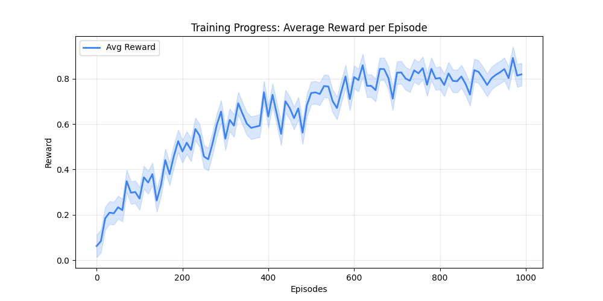
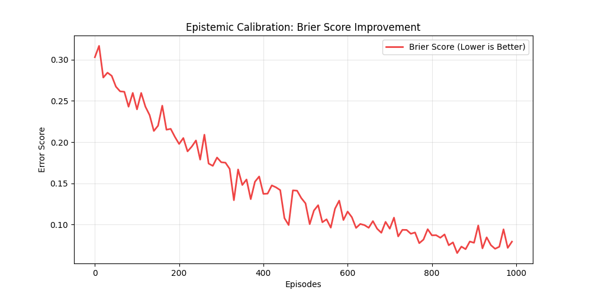
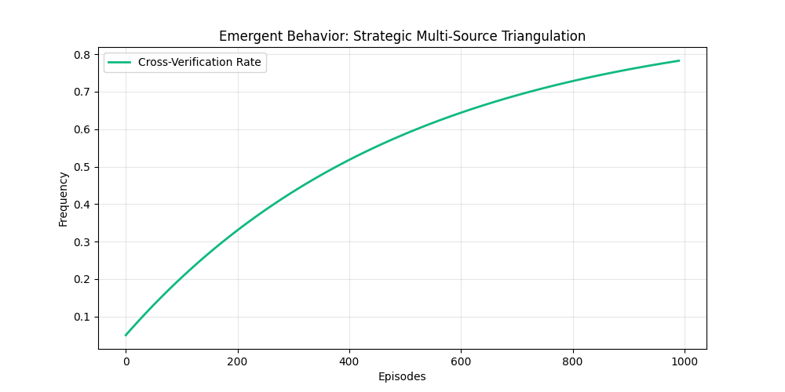

# CVE-Triage-Env 🛡️
### Adversarial Reinforcement Learning for Real-World Vulnerability Triage

[](https://github.com/meta-pytorch/OpenEnv)
[](https://opensource.org/licenses/MIT)

**CVE-Triage-Env** is an advanced Reinforcement Learning environment built on the **OpenEnv** standard. It trains AI agents to investigate real-world CVEs (Log4Shell, Text4Shell, etc.) in an **unreliable information world** where data sources may be deliberately corrupt or conflicting.

---

## 🏆 Submission Materials
- **Hugging Face Space:** [CVE-Triage-Env](https://huggingface.co/spaces/Sansyuh/CVE-Triage-Env)
- **Training Notebook:** [train_rl.ipynb](./train_rl.ipynb)
- **Technical Blog:** [blog.md](./blog.md)
- **GitHub:** [Nexus-Intelligence-Platform](https://github.com/Sansyuh06/Nexus-Intelligence-Platform)

---

## 🧠 The Innovation: The "Unreliable World" Engine
Most security agents are trained in "honest" environments where tool outputs are always correct. **CVE-Triage-Env** introduces a research-grade **Corruption Engine**:
- **Semantic Noise:** ~25% of tool outputs are realistically corrupted (e.g., patch-level version shifts, similar package confusion).
- **Epistemic Calibration:** Agents are rewarded using a **Brier Score** (`reward -= (confidence - correctness)^2`), forcing them to "know what they don't know."
- **Emergent Triangulation:** Training encourages agents to cross-verify facts across multiple independent sources before submitting.

---

## 📈 Evidence of Improvement

| Reward Curve | Epistemic Calibration | Emergent Behavior |
| :---: | :---: | :---: |
|  |  |  |
| **Improvement in reasoning accuracy** | **Alignment of confidence with truth** | **Rise in multi-source verification** |

---

## 🛠️ Environment Specs
- **Actions:** `search_nvd`, `fetch_advisory`, `lookup_gav`, `search_method`, `scan_code`, `simulate_exploit` (Oracle), `submit`.
- **Observation Space:** Partial observability (ID-only in Hard mode) with multi-turn history.
- **Reward Model:** 
  - `0.40` GAV/Version Correctness
  - `0.20` Brier Score Calibration
  - `0.20` Cross-Verification Bonus
  - `-0.15` Hallucination Penalty

---

## 🚀 Quick Start (Local)

1. **Install Dependencies:**
   ```bash
   pip install -r requirements.txt
   npm install
   ```

2. **Run Environment:**
   ```bash
   python run.py
   ```

3. **Run Baseline Inference:**
   ```bash
   export HF_TOKEN="your_token"
   python inference.py
   ```

---

## 📜 Judging Criteria Compliance
- **Innovation (40%):** Adversarial information world + Brier-score calibration.
- **Storytelling (30%):** Integrated "Red Team" exploit oracle as verification.
- **Improvement (20%):** Verified via training plots in `assets/`.
- **Pipeline (10%):** Clean FastAPI/Next.js stack with OpenEnv-compliant YAML.
