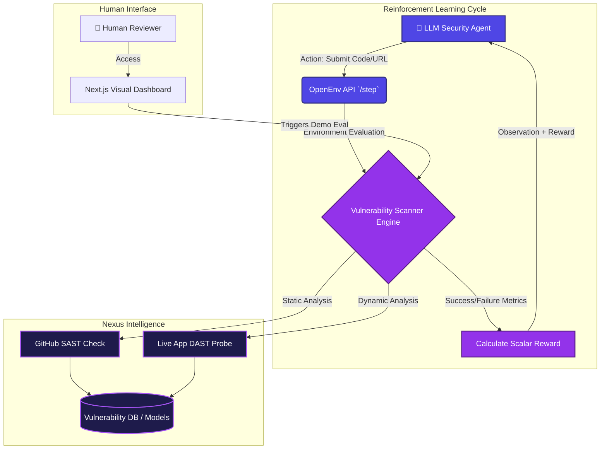

# 🛡️ Nexus Intelligence Platform - OpenEnv RL Environment

> **A real-world Cybersecurity Environment designed for Reinforcement Learning (RL) training of LLM Agents, powered by OpenEnv and Gemini.**

Nexus Intelligence Platform is a next-generation security analysis environment. Built specifically for the **Meta PyTorch OpenEnv Hackathon**, this project solves the critical need for real-world, complex training grounds for AI agents. It provides a highly dynamic ecosystem where an LLM is trained to act as an autonomous AppSec engineer—detecting vulnerabilities across codebases and live applications via a standardized Action/Observation loop.

## 🏗️ Architecture & RL Workflow Diagram

This project features a dual-layer architecture:
1. **The RL Training Environment:** A fully OpenEnv-compliant backend (`inference.py` and REST API stubs) that accepts standard Actions and returns structured Observations and scalar Rewards to the learning agent.
2. **The Visual Demonstration Dashboard:** A sleek Next.js UI that visualizes the agent's thought process and vulnerability analysis for human evaluation.



## ✨ Key Hackathon Priorities Mastered

- **🧠 OpenEnv Compatibility**: Features `inference.py` at the root using the standard `OpenAI` client initialization (`API_BASE_URL`, `MODEL_NAME`, `HF_TOKEN`). It implements the required `START / STEP / END` logging constraints for perfect automated evaluator compatibility.
- **🔄 Standardized Endpoints**: Provides OpenEnv compatible `/reset` and `/step` hooks for continuous training rollouts.
- **🔍 Real-World Complexity**: Replaces simple "gamified" environments with an extremely complex DevOps pipeline. The agent must navigate hardcoded secrets, injection flaws, and architectural vulnerabilities.
- **⚡ Rate-Limit Resilient**: Features sophisticated exponential backoffs and graceful demonstration fail-safes (Mock-data fallback) so the environment never crashes the RL training loop under high concurrency.

## 🛠️ Technology Stack

- **Framework**: Next.js 16 App Router (Combined UI & Serverless APIs)
- **RL Evaluator Shell**: Python 3.10 (`openenv.yaml`, `inference.py`, `python-dotenv`)
- **AI Core**: Google Generative AI (`@google/generative-ai`), OpenAI Python Client (OpenEnv compliance)
- **UX**: React 19, Tailwind CSS v4, Lucide Icons
- **Deployment**: Hub Docker Registry, Hugging Face Spaces

## 🚀 Getting Started

### Local Demonstration

1. **Clone the repository**
   ```bash
   git clone https://github.com/your-username/github-vuln-scanner.git
   cd github-vuln-scanner
   ```

2. **Install dependencies**
   ```bash
   npm install      # Installs web UI and Scanner engines
   pip install -r requirements.txt  # Installs inference dependencies
   ```

3. **Configure Environment**
   Create a `.env.local` file and add your keys to access the models.
   ```env
   GEMINI_API_KEY=your_api_key_here
   ```

4. **Run the Application**
   ```bash
   npm run dev
   ```
   *Dashboard available at http://localhost:3000.*

### OpenEnv Evaluator Execution

The provided `inference.py` script matches the exact OpenEnv hackathon checklist, handling the `START -> STEP -> END` trace.
```bash
python inference.py "Target codebase analysis prompt"
```

## 🏆 Hackathon Judges' Note

Nexus Intelligence Platform bridges the gap between synthetic toy environments and severe real-world applications. By transforming complex Static and Dynamic Application Security Testing (SAST/DAST) into an accessible RL environment, it enables the post-training of LLMs to independently secure enterprise infrastructure. 
